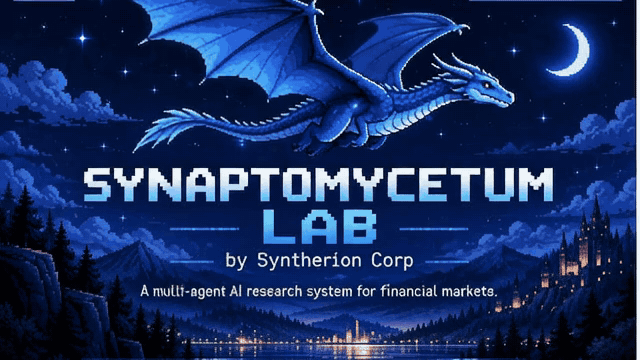
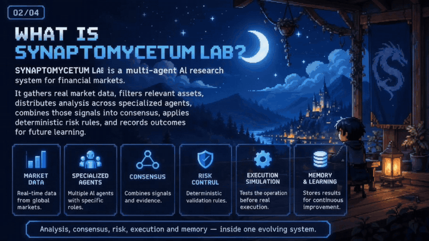
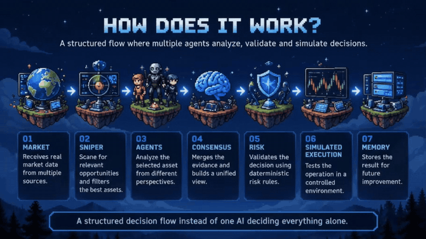
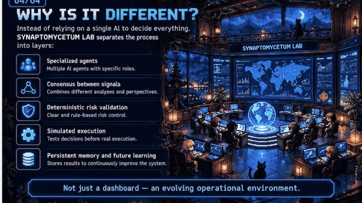

# SYNTHERION CORP

**TECNOLOGIA · INTELIGÊNCIA ARTIFICIAL · APRENDIZADO**

*Aprendendo hoje para construir as soluções de amanhã.*

---

### Olá! Sou o Lucas 👋

Estou aprendendo a programar e sou entusiasta do mundo da tecnologia e da inteligência artificial. Estou me preparando para cursar **Análise e Desenvolvimento de Sistemas na FATEC Paulínia**.

Meu sonho é trabalhar com tecnologia, transformar esse interesse em carreira e construir minha fonte de renda desenvolvendo soluções úteis. Também tenho interesse em explorar a conexão entre inteligência artificial e o mundo financeiro.

A **Syntherion Corp** é a identidade que estou construindo para reunir minhas ideias, experimentos e projetos. Este perfil acompanha minha evolução: aprendizado, tentativas, ajustes e novas descobertas.

### O que estou explorando

| Programação | Inteligência artificial | Produtos digitais |
| :--- | :--- | :--- |
| Aplicações web e fundamentos de desenvolvimento | Agentes, assistentes e automação | Interfaces, dashboards e ferramentas úteis |

### Meu projeto em desenvolvimento

**SYNAPTOMYCETUM LAB**

Um laboratório pessoal de pesquisa e experimentação com inteligência artificial, desenvolvido como parte da minha jornada de aprendizado.

`Em desenvolvimento` · `Código privado` · `Syntherion Corp`

O projeto ainda não está pronto: há funcionalidades, integrações, testes e melhorias a concluir. Esta página apresenta apenas uma visão geral; o código e os detalhes de implementação ficam em um repositório privado.

### Conheça o SYNAPTOMYCETUM LAB

Uma apresentação visual da proposta do laboratório. As cenas ilustram o conceito e a arquitetura planejada de um projeto ainda em desenvolvimento.

#### 01 · Apresentação

#### 02 · O que é o laboratório?

A proposta reúne agentes especializados para pesquisar dados de mercado, combinar análises e registrar resultados.

#### 03 · Como funciona?

O fluxo proposto passa por dados de mercado, seleção de oportunidades, análise dos agentes, consenso, validação de risco, simulação e memória.

#### 04 · O que torna a proposta diferente?

Dividir responsabilidades entre agentes e etapas de validação, com simulação e registro para apoiar futuras melhorias.

### Minha direção

- Aprender os fundamentos e evoluir com prática.
- Construir projetos que resolvam problemas reais.
- Desenvolver experiência para trabalhar com tecnologia e IA.
- Transformar ideias em oportunidades profissionais.

---

**SYNTHERION CORP**  
Uma ideia de cada vez. Um aprendizado a cada passo.

